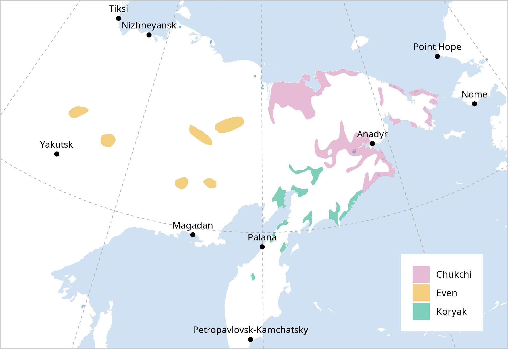

<style>
img {
  border: none !important;
  box-shadow: none !important;
}
</style>

```{r packages and options, include = FALSE}
knitr::opts_chunk$set(
  collapse = TRUE,
  message = FALSE,
  warning = FALSE,
  eval = FALSE,
  comment = "#>"
)
```

This vignette demonstrates how to create language maps using `Rglottography`, together with a selection of geospatial and data visualisation packages:

- `sf`: package for working with spatial data; it allows you to handle, manipulate, and analyse the geometries of the `Rglottography` speaker area polygons.
- `dplyr`: data manipulation package, useful for filtering, selecting, and preparing the language datasets before mapping.
- `ggplot2`: data visualisation package; when combined with `sf`, it helps you create layered and customisable maps.
- `rnaturalearth`: provides access to Natural Earth datasets, including landmasses, oceans, rivers, and populated places; used to add contextual layers and geographical reference to the language maps.

Note that the code used to generate the map is shown but not executed during package checks.

```{r libraries}
all(
  requireNamespace("sf", quietly = TRUE),
  requireNamespace("dplyr", quietly = TRUE),
  requireNamespace("ggplot2", quietly = TRUE),
  requireNamespace("rnaturalearth", quietly = TRUE)
)
```

```{r setup-load-ne, include=FALSE, eval=FALSE}
# Helper function: load Natural Earth data
load_ne <- function(type = c("land", "ocean", "populated_places", 
                             "countries", "rivers_lake_centerlines", "lakes")) {
  type <- match.arg(type)
  
  category <- if (type %in% c("land", "ocean", "rivers_lake_centerlines", "lakes")) {
    "physical"
  } else {
    "cultural"
  }
  
  path <- file.path("data", "natural_earth")
  ne_file <- file.path(path, paste0("ne_", type, ".gpkg"))
  
  if (!dir.exists(path)) dir.create(path, recursive = TRUE)
  
  if (file.exists(ne_file)) {
    ne_sf <- sf::st_read(ne_file, quiet = TRUE)
  } else {
    ne_sf <- rnaturalearth::ne_download(
      scale = "large",
      type = type,
      category = category,
      returnclass = "sf"
    ) 
    sf::st_write(ne_sf, ne_file, 
                 layer_options = "GEOMETRY_NAME=geometry", 
                 quiet = TRUE, delete_layer = TRUE)
  }
  
  ne_sf
}
```

## Loading Glottography Language Polygons

We begin by loading the Glottography dataset `matsumae2021exploring` and extracting the language-level polygons. Using `dplyr::filter()` and the relevant Glottocodes, we select the Even, Koryak, and Chukchi languages. The resulting polygons are then reprojected to a custom Lambert Azimuthal Equal Area projection, centred over northeastern Siberia (`arctic_proj`). This projection was identified using the [Projection Wizard](https://projectionwizard.org/), an online tool for selecting map projections tailored to specific geographic regions. As a planar, equal-area projection, it preserves area and supports reliable distance-based spatial operations in high-latitude regions.

```{r load-glottography, eval=FALSE}
arctic_proj <- paste0(
  "+proj=aea +lon_0=159.609375 +lat_1=51.7903305 ",
  "+lat_2=74.6587299 +lat_0=63.2245302 +datum=WGS84 ",
  "+units=m +no_defs")

glottography <- load_datasets("matsumae2021exploring")
languages <- glottography$languages

even_kory_chuk <- languages |> 
  dplyr::filter(glottocode %in% c("even1260", "kory1246", "chuk1273")) |>
  sf::st_transform(arctic_proj) 

```

## Loading Natural Earth Data

We load Natural Earth data for landmasses, oceans, lakes (polygons), rivers (lines), and populated places (points). The helper function `load_ne()`, defined in the appendix of this tutorial, is used to download and cache these layers via `rnaturalearth`.

Because these datasets are global, we reproject them to our custom Arctic Lambert Azimuthal Equal-Area projection and then clip them to the data extent. Reprojecting is necessary because working in a polar region can cause certain spatial operations, such as intersection and buffering, to behave unpredictably in geographic coordinates (`EPSG:4326`). By using a planar, area-preserving projection specifically designed for high-latitude regions these spatial operations become reliable.

The data extent is defined as a buffered bounding box around the Even, Koryak, and Chukchi polygons:

```{r map-extent, eval=FALSE}
clip_extent <- even_kory_chuk |> 
  sf::st_bbox() |>
  sf::st_as_sfc () |>
  sf::st_buffer(dist = 700000)  # buffer in metres
```

We then read each layer as follows:

```{r natural-earth, eval=FALSE}
land <- load_ne("land") |>
  sf::st_transform(arctic_proj) |>
  sf::st_make_valid()|>
  sf::st_intersection(clip_extent)

ocean <- load_ne("ocean") |>
  sf::st_transform(arctic_proj) |>
  sf::st_make_valid()|>
  sf::st_intersection(clip_extent)

populated_places <- load_ne("populated_places") |> 
  dplyr::filter(SCALERANK < 4) |>  # retain only relatively large places
  sf::st_transform(arctic_proj) |>
  sf::st_make_valid()|>
  sf::st_intersection(clip_extent)

rivers <- load_ne("rivers_lake_centerlines") |> 
  dplyr::filter(scalerank < 7) |>  # retain only relatively large rivers
  sf::st_transform(arctic_proj) |>
  sf::st_make_valid()|>
  sf::st_intersection(clip_extent)

lakes <- load_ne("lakes") |>
  dplyr::filter(scalerank < 7) |>  # retain only relatively large lakes
  sf::st_transform(arctic_proj) |>
  sf::st_make_valid()|>
  sf::st_intersection(clip_extent)
```

Each layer is first reprojected, then validated with `st_make_valid()` to fix potential geometry issues arising from reprojection, and finally clipped to the buffered map extent. This ensures that only the relevant features appear on the map, reduces computational load, and prevents errors when performing spatial operations in high-latitude regions.

## Creating the base map 

First, we create the base map using the land, ocean, and lake polygons, specifying fill colours for each layer and omitting borders for a clean look.
```{r base-map, eval=FALSE}
language_map <- ggplot2::ggplot() +
  ggplot2::geom_sf(data = land, fill = "white", color = NA) +
  ggplot2::geom_sf(data = ocean, fill = "#D0E1F2", color = NA) +
  ggplot2::geom_sf(data = lakes, fill = "#7FB4D6", color = NA)
```

Next, we add graticules to the map, which provide a subtle reference for latitude and longitude.

```{r graticules, eval=FALSE}
graticules <- sf::st_graticule(lons = c(150, 180), 
                           lats = c(50, 80)) |>
  sf::st_transform(arctic_proj) |>
  sf::st_geometry() |>
  sf::st_intersection(clip_extent)
  
language_map <- language_map +
  ggplot2::geom_sf(data = graticules, color = "grey70", linetype = "dashed", linewidth = 0.3)
```

## Overlaying Languages and Geographic Features

We now overlay the Even, Koryak, and Chukchi language polygons on the base map, using semi-transparent fills to allow the underlying geographic context to remain visible.

```{r languages, eval=FALSE}
language_map <- language_map +
  ggplot2::geom_sf(data = even_kory_chuk, 
                   ggplot2::aes(fill = name), color = NA, alpha = 0.5)
```

Next, we add populated places to the map, along with their labels. Labels are slightly offset vertically using (`nudge_y`) to improve readability.

```{r populated-places, eval=FALSE}
language_map <- language_map +
    ggplot2::geom_sf(data = populated_places) +
    ggplot2::geom_sf_text(
      data = populated_places,
      ggplot2::aes(label = NAME),
      size = 3,
      nudge_y = 70000 #vertical offset in metres
    ) 
```

## Adding a legend

We now add a legend to the map, assigning custom colours to each language. The legend title is removed for a cleaner appearance.

```{r legend, eval=FALSE}
color <-c("#CC79A7", "#E69F00", "#009E73")
names(color) <- even_kory_chuk$name

language_map <- language_map +
    ggplot2::scale_fill_manual(
      values = color,
      labels = names(color),
      guide = ggplot2::guide_legend(title = NULL) 
    )
```

## Map extent 

The map extent of the final visible map is a slightly smaller rectangle than the clipped data extent. This ensures that features near the edges are not truncated and gives the map some margin for a cleaner appearance. In the code below, we calculate the bounding box of the clipped data (`clip_extent`) and apply an offset to create the visible map extent:

```{r map extent, eval=FALSE}
bbox <- sf::st_bbox(clip_extent)
offset <- 200000 
  
language_map <- language_map +
  ggplot2::coord_sf(crs = arctic_proj, 
           xlim = c(bbox["xmin"] + offset, bbox["xmax"] - offset),
           ylim = c(bbox["ymin"] + offset, bbox["ymax"] - offset),
           expand = FALSE, datum = NA)
```

We set `expand = FALSE` and `datum = NA` to ensure the map is drawn exactly within the specified bounds and to prevent any automatic reprojection or padding.

## Setting the map theme

We apply a minimal theme with `theme_void()` to remove axes and background elements, and add a grey border around the map for clarity.
We also move the legend inside the plot and give it a white background.

```{r theme, eval=FALSE}
language_map <- language_map + 
  ggplot2::theme_void() +
  ggplot2::theme(
    panel.border = ggplot2::element_rect(
      color = "grey", fill = NA, linewidth = 0.5),
    legend.position = "inside",
    legend.position.inside = c(0.95, 0.05),
    legend.justification = c(1, 0),
    legend.background = ggplot2::element_rect(fill = "white", color = NA),
    legend.box.background = ggplot2::element_rect(fill = "white", color = NA),
    legend.margin = ggplot2::margin(10, 10, 10, 10)
  )
```

## Displaying the map

The map below illustrates the speaker areas of Even, Chukchi, and Koryak in eastern Siberia. While it was generated using the code shown above, it is included here as a pre-rendered figure.

```{r map-prerendered, echo = FALSE, eval=TRUE, out.width="100%", fig.align="center"}

```


## Collecting references

To acknowledge the primary sources used to construct the map, we can collect the scientific references associated with all language polygons included in the data. For any Glottography object, such as a complete collection or a set of languages, `collect_sources()` returns the corresponding bibliographic entries in BibTeX format. These references can be printed to the console or written to a file for inclusion in a publications or supplementary materials.

```{r collect-sources, eval = FALSE}
sources <- collect_sources(even_kory_chuk)
```

## Appendix

The `load_ne()` function downloads or reads cached Natural Earth geometries as `sf` objects. It supports land, ocean, lakes, rivers, countries, and populated places. If a cached `GeoPackage` exists in `data/natural_earth`, it is used; otherwise the data are downloaded from Natural Earth and saved locally for future reuse.

```{r load_ne function, eval = FALSE}
#' Helper function to load NaturalEarth data 
#'
#' This function loads Natural Earth geometries for land, ocean, 
#' populated places, countries or rivers as an `sf` object.
#' It first checks for a cached GeoPackage under `data/natural_earth` 
#' (e.g., `ne_land.gpkg` or `ne_ocean.gpkg`). If the file exists, it is read
#' directly. Otherwise, the data is downloaded from Natural Earth using
#' `rnaturalearth`, stored as an `sf` object, and saved locally for future reuse.
#'
#' @param type Character; `"land"`, `"ocean", "populated_places"`, `"countries"` 
#' `"rivers_lake_centerlines"`, `"lakes"` specifying which data to load.
#'
#' @return An `sf` object representing the requested Natural Earth geometries

load_ne <- function(type = c("land", "ocean", "populated_places", 
                             "countries", "rivers_lake_centerlines", "lakes")) {
  type <- match.arg(type)
  
  if (type %in% c("land", "ocean", "rivers_lake_centerlines",
                  "lakes")){
    category = "physical"
  } else if (type %in% c("populated_places", "countries")) {
    category = "cultural"
  }
  path <- file.path("data", "natural_earth")
  ne_file <- file.path(path, paste0("ne_", type, ".gpkg"))
  
  if (!dir.exists(path)) {
    dir.create(path, recursive = TRUE)
  }
  
  if (file.exists(ne_file)) {
    # Read cached file
    ne_sf <- sf::st_read(ne_file, quiet = TRUE)
  } else {
    # Download from Natural Earth
    ne_sf <- rnaturalearth::ne_download(
      scale = "large",
      type = type,
      category = category,
      returnclass = "sf"
    ) 
    # Save as GeoPackage for future reuse
    sf::st_write(ne_sf, ne_file, 
                 layer_options = "GEOMETRY_NAME=geometry", 
                 quiet = TRUE, delete_layer = TRUE)
  }
  ne_sf
}

```

